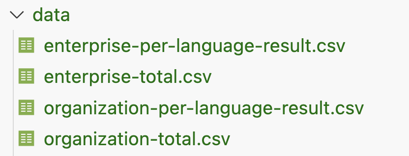
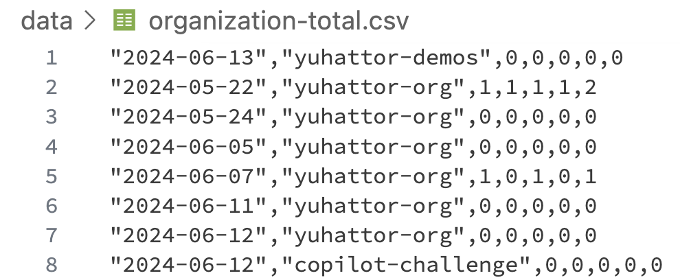

# Copilot Metrics CSV Exporter

This project is a set of scripts that generate CSV files for the Usage Metrics API.

```sh
sh main.sh [enterprise_name] 
```

And the following CSV files will be generated:

- Total usage metrics for the enterprise
- Usage metrics per language for the enterprise
- Total usage metrics per organizations
- Usage metrics per language per organizationss

The data will be saved in the `data` folder. You can back up historical data by automating it with GitHub Actions.





## GitHub Actions Configuration

1. Set up the following secrets in the GitHub repository:
   - `GITHUB_TOKEN`: GitHub token with the right permissions for GitHub Copilot Metrics(See the detail: https://docs.github.com/rest/copilot/copilot-usage)
   - `ENTERPRISE_SLUG`: Name of the enterprise
2. That's it. Now all you have to do is sleep and wait. Alternatively, it can be triggered manually.
---
## Usage for each script

This script will generate CSV files for the Usage Metrics API

### Organization list

```bash
sh get-orgs.sh [enterprise_name]
```

### Organization Metrics

Generate total usage metrics for a specific organization

```bash
sh total-org.sh [organization_name] [destination_file_path]
```

Generate usage metrics per language for a specific organization

```bash
sh per-language-org.sh [organization_name] [destination_file_path]
```

### Enterprise Metrics

Generate total usage metrics for a specific enterprise

```bash
sh total-ent.sh [enterprise_name] [destination_file_path]
```

Generate usage metrics per language for a specific enterprise

```bash
sh per-language-ent.sh [enterprise_name] [destination_file_path]
```
